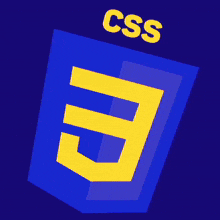
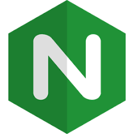

  

---

<h1 align="center"><strong>Hi there 👋, I'm Akinniran Oluwatosin</strong></h1>

<strong>👨‍💻 Software Engineer | Passionate About Building Innovative Solutions 🚀</strong>

- 🚀 Currently Building: AutoTrack – A web application where customers can track their vehicle's workshop status via auto-generated notifications.
- 💡 Currently Learning: Django, Django REST Framework, and React Native to enhance my backend and frontend development skills.
- 🤝 Open To: Gigs, projects, internships, and collaborations—let’s create something impactful together!
- 📫 How to reach me akinniranoluwatosin22@gmail.com

### Connect with me:
 

---

### 🛠️ About Me
I am a passionate Software Engineer with a strong drive for creating innovative solutions and tackling complex challenges. My journey began with a deep interest in programming and has evolved through an intensive Software Engineering Program in 
African Leadership Experience, where I gained valuable experience working on a variety of projects. I enjoy solving real-world problems through software and am currently focused on developing more solution driven projects. Always eager to learn and grow, I am open to opportunities that will allow me to contribute, collaborate, and further hone my skills.

### 📂 Featured Projects
Here are some of my projects:

Simple Shell in C: A deep dive into low-level programming.
AIRBNB Clone: A fully functional platform simulation with authentication and search capabilities.
Expense Tracker App: A full-stack application for managing personal finances.
DevOps Configuration Scripts: Scripts for server setup, load balancing, and security.

### Languages and Tools:

